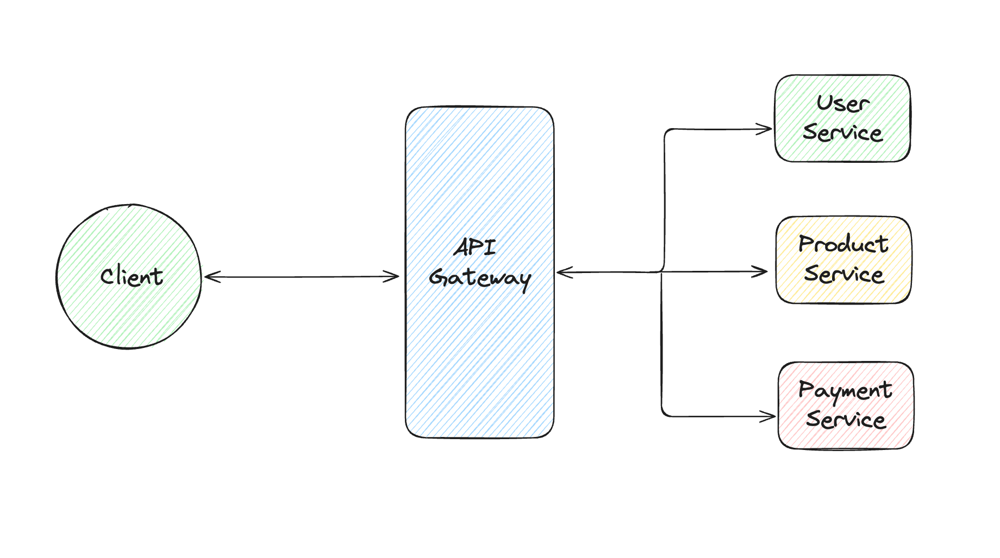

# API Gateway

## Overview

The **API Gateway** is a robust and scalable gateway built in **Golang** using the **Gin** framework. It serves as the entry point to multiple microservices, providing essential features like authentication, rate limiting, IP whitelisting, TLS termination, and request routing. Designed for high performance, the gateway can handle **100+ concurrent requests per second** with low latency and enhanced security.

## Features

- **JWT Authentication**: Ensures secure access to APIs by validating tokens.
- **Rate Limiting**: Implements token bucket algorithm to limit requests to **100 requests/second**, preventing abuse and maintaining service quality.
- **IP Whitelisting**: Allows requests only from authorized IPs, enhancing security.
- **Circuit Breaker Pattern**: Prevents cascading failures by intelligently blocking requests during service disruptions.
- **Caching with Redis**: Speeds up response times and reduces backend load by **60%**.
<!-- - **URL Rewriting**: Supports API versioning and seamless routing of legacy endpoints.
- **Throttling**: Limits excessive API usage to protect backend services.
- **TLS Termination**: Secures communication by handling HTTPS connections. -->



## Tech Stack

- **Backend**: Golang, Gin Framework
- **Caching**: Redis
- **Authentication**: JWT
<!-- - **Containerization**: Docker, Kubernetes
- **Database**: PostgreSQL (if required for dynamic configuration) -->

## Architecture

The API Gateway serves as a reverse proxy, providing:

1. Authentication and authorization using JWT.
2. Rate-limiting and throttling to protect microservices from overload.
3. Intelligent routing and load balancing.
4. Circuit breaker to ensure service reliability during failures.
<!-- 5. Centralized logging and monitoring for observability. -->

## Installation

### Prerequisites

- Golang (1.19 or above)
- Redis
- Docker (optional for containerization)

### Steps

1. Clone the repository:
   ```bash
   git clone https://github.com/Animesh-roy100/api-gateway.git
   cd api-gateway
   ```
